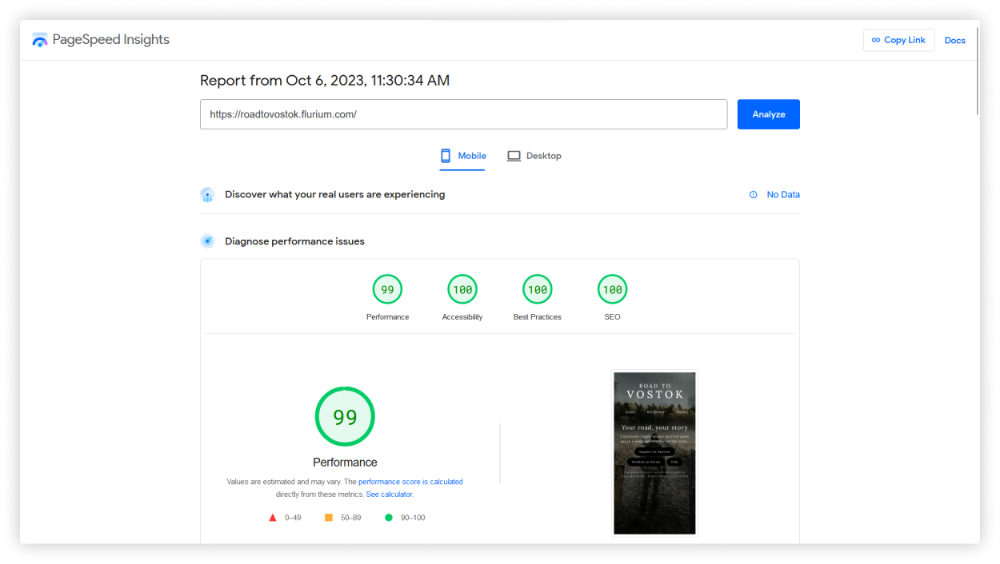

# Road To Vostok remake

Remake of Road to Vostok website to make it faster with new technologies.

## Technologies and infra

- Astro js
- Svelte js for client-side
- Tailwind
- Vercel for hosting

## Performance improvements

Currently only landing page is made. And it doesn't contain full functionality,
but main performance pain point (youtube videos) is remade.

Original website: [Link to Pagespeed]()

My remake: [Link to Pagespeed](https://pagespeed.web.dev/analysis/https-roadtovostok-flurium-com/e0go5c5j6e?form_factor=mobile)
